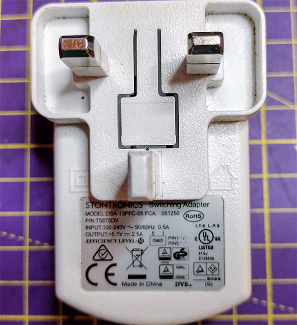

## Power a Raspberry Pi Pico using a USB supply

The Raspberry Pi Pico requires a power supply capable of delivering a minimum of 1.8 volts and a maximum of 5.5V.

Most micro-USB transformers can provide power to your Raspberry Pi Pico in this range. For instance the official Raspberry Pi micro-USB transformer provides up to 2.5A of current at 5.1V

A battery pack with a USB to micro-USB cable can also power a Raspberry Pi Pico. This battery pack provides up to 2.1A of current at 5V.

- Connect the Raspberry Pi Pico to your transformer or battery pack.

- If the Raspberry Pi Pico is sufficiently powered, the onboard LED should blink seven times.

